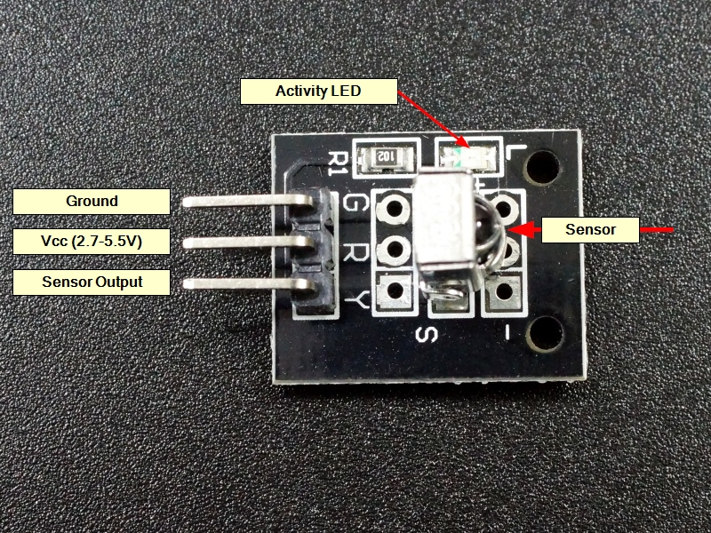

# IR Remote Controlled Vehicle

An IR remote containing various buttons each associated with a unique code can be used to send command to a vehicle in order to control its motion. The IR receiver placed on the vehicle receives these coded signals and conveys them to a microcontroller on board which then translates these codes to a corresponding command. Appropriate signals are then send to the motor driver based on these commands which in turn drives the motors in desired speed and direction therby controlling the motion of the vehicle.

## WHat is...
### 1. IR remote and sensor
An IR remote can be used as a cheap solution for wireless communication in the infrared spectrum of light. It contains different buttons each associated with a unique code. When a button is pressed, a LED is turned ON and OFF producing a pulse width modulated wave containing the code as message signal. The modulated signals are received by the receiver which demodulates it and provides the original code at sensor ouput pin. This code can be then given as input to a microcontroller which then translates it to a command. 
</br>
<p align="left">
  
</p>
</br>

### 2. PWM
<p>Which stands for pulse width modulation is a process of varying the time for which a pulse remains ON. This way the average power delivered by a signal can be controlled. The longer the pulse remains ON compared to its OFF time, the higher the total power supplied to the load.</p>
<p>Duty cyle represents the proportion of ON time of a pulse to its total time period. It is represented in percentage.</p>
</br>
<p align="left">
  
</p>
</br>
An Arduino uno has 6 PWM output pins (3,5,6,9,10,11) labeled with ~ sign. PWM signals can be given using the in-built function "analogWrite()" in Arduino IDE.
</br>

### 3. L298N
<p>L298N is a dual channel motor driver. The H bridge is used to control the direction of the motors by provding HIGH(1) and LOW(0) signals to the direction control pins (IN1,IN2,IN3,IN4).The speed can be controlled by proving PWM signals to these pins.</p>
<p align="left">
  
</p>

## Components and supplies
<ul>
<li>IR remote and sensor x 1</li>
<li>Arduino Uno X 1</li>
<li>DC motor(generic) X 4</li>
<li>Jumper wires(generic) X 1</li>
<li>L298N motor driver X 1</li>
<li>USB A to B cable X 1</li>
</ul>

## Working
<p>The code associated with each button in the IR remote is found. Each code is then assigned to a command that can be used to control the vehicle.</p>
<p>The buttons on the remote are pressed. This sends the corresponding code as modulated IR waves. These waves are received by the IR receiver which demodulates and extracts the code and feeds it to the microcontroller, Arduino Uno. The microcontroller then translates this code to the correspoing command and send PWM signals to the L298N motor driver which in turn drives the motors to move the vehicle according to the command.</p>

## Code
Main code given to Arduino. Rest of the code is in the ir-remote-conrolled-car-code directory.
<details>
<summary>Click to expand code...</summary>
<p>

```c++
#include <IRremote.h>
#include "pins.h"

int decoded_val = 0;

IRrecv ir_recv(ir_recv_pin);

void setup() {
  Serial.begin(9600);
  ir_recv.enableIRIn();
}

#include "vehicleCommands.h"

void loop() {
  if (ir_recv.decode()) {
    ir_recv.resume();
    decoded_val = ir_recv.decodedIRData.command;
    Serial.println(decoded_val); // for debugging

    if(decoded_val == 70){
      moveForward(); // move vehicle forward
    }
    else if(decoded_val == 21){
      moveBackward(); // move vehicle backward
    }
    else if(decoded_val == 67){
      goRight(); // turn vehicle to the right
    }
    else if(decoded_val == 68){
      goLeft(); // turn vehicle to the left
    }
    else{
      stopBot(); // stop the vehicle
    }
    delay(100);
    stopBot();
  }
}
```

</p>
</details>

## Resources
<ul>
<li>IR Remote and Sensor: https://create.arduino.cc/projecthub/electropeak/use-an-ir-remote-transmitter-and-receiver-with-arduino-1e6bc8</li>
<li>Find the code associated with each button in the remote: https://www.instructables.com/Finding-the-IR-Codes-of-Any-IR-Remote-Using-Arduin/</li>
<li>PWM: https://create.arduino.cc/projecthub/muhammad-aqib/arduino-pwm-tutorial-ae9d71</li>
<li>L298N: https://lastminuteengineers.com/l298n-dc-stepper-driver-arduino-tutorial/</li>
</ul>